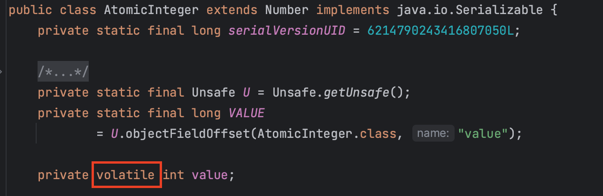
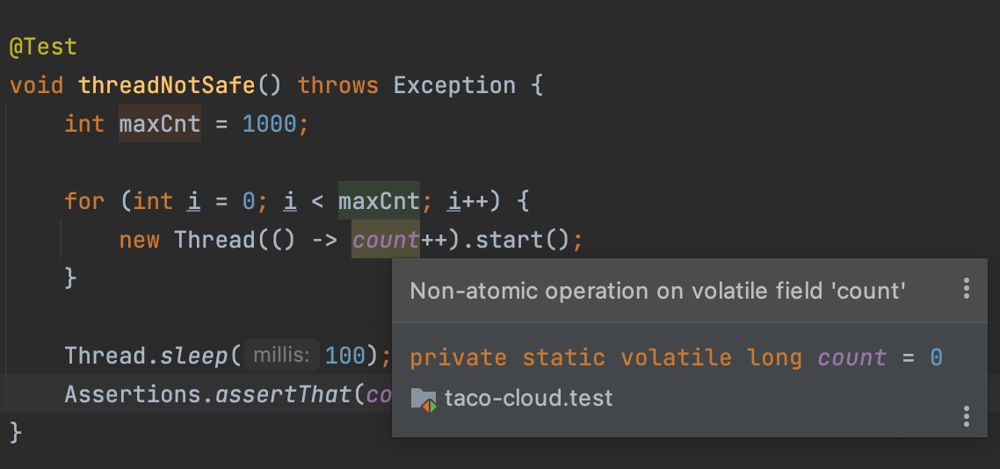
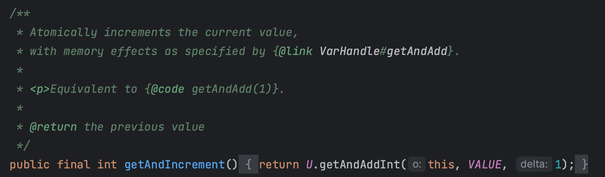
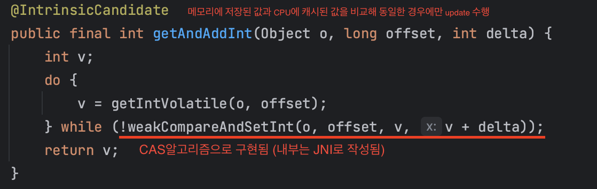

### **Synchronized 키워드**

- **스레드 동기화**
    - 멀티스레드 환경에서 여러 스레드가 **하나의 공유자원에 동시에 접근하지 못하도록 막는것**
    - 공유데이터가 사용되어 동기화가 필요한 부분을 임계영역(critical section)이라고 부르며, 자바에서는 이 임계영역에 **synchronized 키워드**를 사용하여 여러 스레드가 동시에 접근하는 것을 금지함으로써 동기화

### Synchronized 키워드가 붙는 곳에 따라 각각 어떤 의미를 갖는가

- 메소드
    - Synchronized method는 **클래스 인스턴스**에 lock을 걺

        ```java
        synchronized void increase() {
        	count++;
        	System.out.println(count);
        }
        ```

    - 인스턴스에 lock을 거는 synchronized 키워드는 synchronized가 적용된 메서드끼리 일괄적으로 lock을 공유
- 코드블럭
    - 동기화를 많이 사용하면 효율이 떨어지게 되므로 꼭 필요한 부분에만 블럭을 지정하여 임계영역으로 설정 가능
    - synchronized block은 **인스턴스의 block 단위**로 lock을 걸고 lock 객체를 지정해야함
    - block에는 객체를 지정할 수도 있고 class 형식으로 넘기면 해당 class에 lock을 걸 수 있음

    ```java
    void increase() {
    	synchronized(this) {
    		count++;
    	}
    	System.out.println(count);
    }
    ```


### 효율적인 코드 작성 측면에서, Synchronized는 좋은 키워드인가

- 특정 스레드는 synchronized 메서드에 접근 시 블록 전체에 lock을 걺
- 따라서 해당 스레드가 블럭을 빠져나가기 전까지 다른 스레드들은 동기화 처리된 블록에 접근할 수 없음
- 하지만, 다른 스레드들은 아무런 작업을 하지 못하고 기다릴 수밖에 없어 **자원의 낭비가 발생**할 수 있음
- synchronized로 선언된 블록 내부에 복잡한 로직이 들어간다면, 스레드의 개수가 많으면 많을수록 실행 시간에 엄청난 지연이 생길 것

### Synchronized를 대체할 수 있는 자바의 동기화 기법

- HashTable, ConcurrentHashMap등은 내부적으로 synchronized를 사용하므로 제외
- Lock & Condition
    - Lock
        - synchronized블럭 외에도 ‘java.util.concurrent.locks’패키지가 제공하는 lock클래스들을 이용할 수 있음
        - synchronized블럭을 사용하면 자동으로 lock이 잠기고 풀리므로 편리하며, 해당 블럭내에서 예외가 발생해도 락은 자동적으로 풀림
        - 그러나 때로는 같은 메서드 내에서만 락을 걸수있다는 제약이 불편한데, 이때 락 클래스를 사용함
        - 종류
            - ReentrantLock
                - 재진입이 가능한 락. 가장 일반적인 배타락
                - **배타적인 락이기때문에 무조건 락이 있어야만 임계영역의 코드를 수행할 수 있음**
            - ReentrantReadWriteLock
                - 읽기에는 공유적이고, 쓰기에는 배타적인 락
                - 읽기를 위한 락과 쓰기를 위한 락을 제공
                    - **읽기락이 걸려있으면 다른 스레드가 읽기락을 중복해서 걸고 읽기를 수행 가능** (읽기는 내용을변경하지 않으므로)
                    - 읽기락이 걸린상태에서 쓰기락을 거는것은 허용하지 않음. 반대의 경우도 마찬가지
            - StampedLock
                - ReentrantReadWriteLock에 낙관적인 락의 기능을 추가
                - 락을 걸거나 해지할때 스탬프(long타입의 정수값)을 사용
                - 읽기와 쓰기를위한 락외에 ‘낙관적 읽기 락’이 추가된것
                - 읽기락이 걸려있으면 쓰기락을 얻기위해서는 읽기락이 풀릴때까지 기다려야하는 데 비해, 낙관적 읽기락은 쓰기락에의해 바로 풀림
                - 그래서 낙관적읽기에 실패하면 읽기락을 얻어서 다시 읽어야함
                - **무조건 읽기락을 걸지 않고, 쓰기와 읽기가 충돌할때만 쓰기가 끝난후에 읽기락을 거는것**
    - Condition
        - wait() & notify()로 스레드의 종류를 구분하지않고 공유객체의 waiting pool에 같이 몰아넣는 대신, **각 스레드를 위한 Condition**을 만들어 각각의 waiting pool에서 따로 기다리도록 할 수 있음

            ```java
            // lock을 생성
            private ReentrantLock lock = new ReentrantLock();
            
            // lock으로 condition을 생성
            private Condition forCook = lock.newCondition();
            private Condition forCustomer = lock.newCondition();
            ```

        - wait()&notify()대신 await()&signal()을 사용하면 됨
        - condition을 통해 wait()&notify()시의 기아현상이나 경쟁상태를 개선할 수 있음
            - 그래도 스레드의 종류에따라 구분하여 통지를할 수 있게 된 것일 뿐이며 여전히 특정 스레드를 선택할 수 없기때문에 같은 종류의 스레드간의 기아현상이나 경쟁상태가 발생할 가능성은 남아있음
- volatile
- 

    - AtomicInteger의 경우 내부적으로 value에 volatile키워드를 사용
    - volatile 키워드가 붙으면 변수를 캐시에 저장하지 않고 Main Memory에 저장
    - 변수를 읽을때 메인메모리에서 읽고, 쓸때도 메인메모리에 씀
    - volatile을 사용하지 않으면 Multi Thread환경에서 Thread가 변수 값을 읽어올 때 각각의 Cache에 저장된 값이 다르기 때문에 변수 값 불일치 문제가 발생
    - 만약 여러 스레드가 동시에 쓸 수 있는 작업을 하는 경우 volatile 만으로는 적합하지 않음
        - Thread 1이 값을 읽어 1을 추가하는 연산을 하고(아직 메모리에 반영 전), Thread 2가 값을 읽어 1을 추가하는 연산을 할때((아직 메모리에 반영 전), 두 개의 Thread가 1을 추가하는 연산을 하여 최종결과가 2가 추가되어야 하는 상황이지만 결과적으로 1만 추가되는 상황이 발생
        - 이렇게 여러 Thread가 write하는 상황에는 synchronized를 통해 변수를 읽고쓰는 작업의 원자성을 보장해야 함
    - 또 하나의 Thread에서만 write하더라도, 그 변수(메모리)에 대한 접근과 수정이 잦다면 다른 스레드에서 read할때 원자성이 보장되지 않을 것임
    - volatile의 특징
        1. mutual exclusion(상호 배제)를 제공하지 않고도 데이터 변경의 가시성을 보장
        2. 원자적 연산에서만 동기화를 보장

           

            - ++ 연산과 같이 원자성이 보장되지 않는 경우 동시성 문제는 동일하게 발생
            - 단지 멀티 코어에서의 모든 스레드가 캐시 없이 최신의 값을 보게 할 뿐임
- Atomic Class
    - 자바에서는 비원자적 연산에서도 동기화를 빠르고 쉽게 이용하기 위한 Atomic 클래스 모음을 제공
    - AtomicInteger의 value 필드에 volatile이 적용되어있음

      

    - AtomicInteger의 increment메소드 (CAS알고리즘으로 구현되어있음)

      

      

    - Non-Blocking 임에도 동시성을 보장하는 이유는 CAS(Compare-and-swap) 알고리즘을 이용하기 때문
        - volatile 키워드를 이용하면서 현재 스레드에 저장된 값과 메인 메모리에 저장된 값을 비교
            - 일치하는 경우 새로운 값으로 교체(thread-safe 한 상태이므로 로직 수행)
            - 일치하지 않는 경우 실패 후 재시도(thread-safe 하지 않은 상태였으므로 재시도)

---

### wait()와 notify()

- 특정 쓰레드가 객체의 락을 가진 상태로 오랜 시간을 보내지 않도록 함
- 동기화된 임계영역의 코드를 수행하다가, 작업을 더이상 진행할 상황이 아니면 일단 wait()를 호출하여 쓰레드가 락을 반납하고 기다리게 함
- 그러면 다른 쓰레드가 락을 얻어 해당 객체에 대한 작업을 수행할 수 있게 됨
- 나중에 작업을 진행할 수 있는 상황이 되면 notify()를 호출해서, 작업을 중단했던 스레드가 다시 락을 얻어 작업을 진행할 수 있게 함
- 오래 기다린 스레드가 **락을 얻는다는 보장이 없음**
    - wait()가 호출되면, 실행중이던 스레드는 해당 객체의 대기실(waiting pool)에서 통지를 기다림
    - notify()가 호출되면, 해당 객체의 대기실에 있던 모든 스레드중에서 임의의 스레드만 통지를 받음
    - notifyAll()은 기다리고 있는 모든 스레드에게 통보를 하지만, 그래도 락을 얻을 수 있는 것은 하나의 스레드뿐이고, 나머지스레드는 통보를 받긴 했지만 락을 얻지 못하면 다시 락을 기다리는 신세가 됨
- 매개변수가 있는 wait()는 지정된 시간동안만 기다림. 즉 지정된 시간이 지난 후에 자동적으로 notify()가 호출되는것
- waiting pool은 객체마다 존재하는 것이므로 notifyAll()이 호출된다고해서 모든 객체의 waiting pool에있는 스레드가 깨워지는 것은 아님
- wait(), notify(), notifyAll()은 동기화블록(synchronized 블록)내에서만 사용할 수 있음